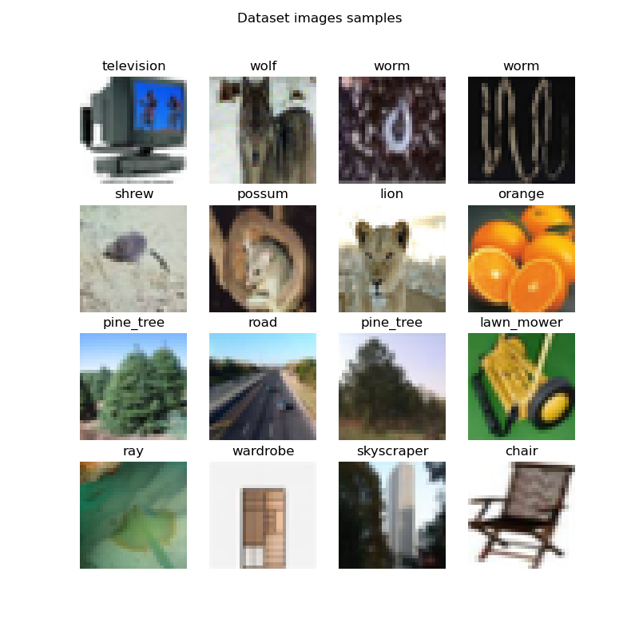
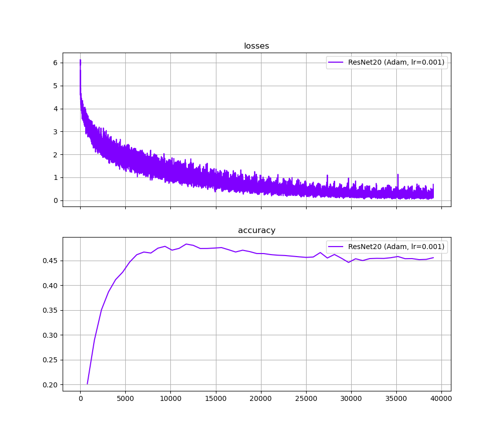

# Lab 2:  Training an Image Classification Network on CIFAR-100 using PyTorch.

**Introduction**

Second practical exercise of the course [Applied Edge AI](https://learn.ki-campus.org/courses/edgeai-hpi2022). In this exercise we have practiced our knowledge on the basic funcionalities of PyTorch by creating an image classification model.
The dataset on which we worked on was the CIFAR-100 dataset, available [here](https://www.cs.toronto.edu/~kriz/cifar.html) and on the `torchvision.datasets` module.

The CIFAR-100 database is a dataset containing `100` classes, where each class contains `600` images, which are divided into `500` images for training and `100` images for testing.
The images have a resolution of `32x32` pixels.

Here are some examples of images from CIFAR100 (created by running the script `example_cifar100_pytorch.py`).



To run an experiment, the command is:
```sh
python run_experiment.py --learning_rate=0.001 --num_epochs=50
```

Where the values of arguments `learning_rate` and `num_epochs` shown are equal to the default values.
The are other arguments, related to the directories of the files for logs and datasets. To see them,
verify the help function when running the script.

## 1. About the model

### 1.1 Neural Network

The model of this laboratory is based on a ResNet-20, that is, a Residual Net with 20 layers.
The feature extraction for this network was pre-defined and implemented by Yerlan Idelbayev, and
can be found [here](https://www.kaggle.com/bartzi/cifar100-resnets).

### 1.2 Training process

For this experiment, the following configuration was used:
- Optimizer: Adam
- Loss function: `CrossEntropyLoss` from the `torch.optim` module
- Learning rate: Fixed, with default value of 0.001
- Batch size: 64
- Number of epochs: Default value of 50
- Metric for evaluating the model: Accuracy

### 1.3 Metrics

Given the default hyperparameters, the obtained metrics are plotted below.



## TODO

- Add augmentation transformation to the Dataset definition.
- Generate results for different learning rates.
