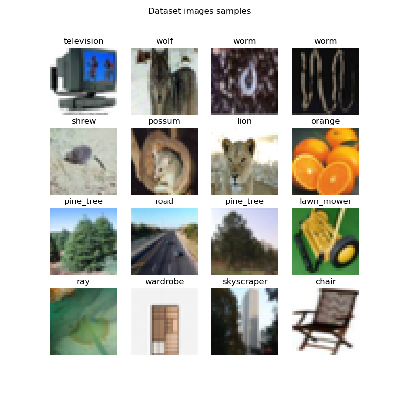
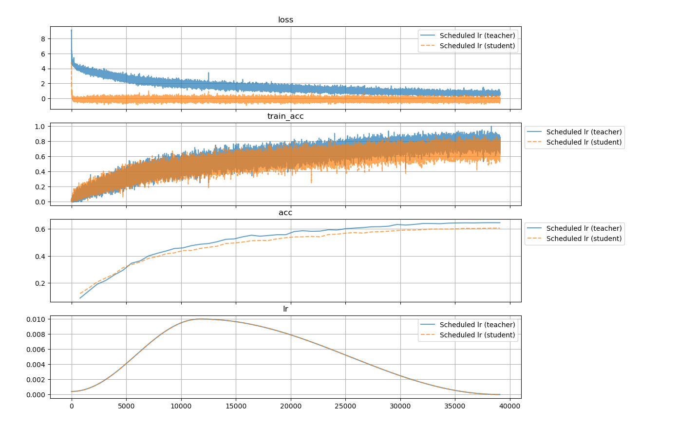

# Lab 3: Performing Knowledge Distillation on CIFAR100

**Introduction**

Third practical exercise of the course [Applied Edge AI](https://learn.ki-campus.org/courses/edgeai-hpi2022).
In this exercise, we train the neural network from the last laboratory and distill its knowledge into a smaller network.

Again about the data.
The dataset on which we worked on was the CIFAR-100 dataset, available [here](https://www.cs.toronto.edu/~kriz/cifar.html)
and on the `torchvision.datasets` module.

The CIFAR-100 database is a dataset containing `100` classes, where each class contains `600` images, which are divided into `500` images for training and `100` images for testing.
The images have a resolution of `32x32` pixels.

Here are some examples of images from CIFAR100 (created by running the script `example_cifar100_pytorch.py`).



To run an experiment, the command is:
```sh
python run_experiment.py --learning_rate=0.001 --num_epochs=50 --teacher_model_class=resnet65 --student_model_class=resnet20
```

Where the values of arguments `learning_rate`, `num_epochs`, `teacher_model_class`, and `student_model_class`
shown are equal to the default values.
The are other arguments, related to the directories of the files for logs and datasets. To see them,
verify the help function when running the script.

## 1. About the models (teacher and student)

### 1.1 Neural Networks

The model of this laboratory is based on a ResNet-56 and ResNet-20, that is, a Residual Net with 56 and 20 layers,
respectively. The feature extraction for this network was pre-defined and implemented by Yerlan Idelbayev, and
can be found [here](https://www.kaggle.com/bartzi/cifar100-resnets).
The larger network, which has more capacity, is used as the teacher model. The smaller one is the student model.

### 1.2 Training process

The knowledge distillation in this example is implemented in a way that the larger and small models are training
simultaneously. The teacher model training process is based only on hard labels provided by the dataset. The small model
is trained using both soft labels provided by the bigger one and also hard labels given by the dataset.

For this experiment, the following configuration was used:
- Loss function used :
  - Teacher model: `CrossEntropyLoss` from the `torch.optim` module
  - Student model: an implementation of a loss function using **Kullback Leibler Divergence**.
- Learning rate: Fixed, with default value of 0.001
- Batch size: Fixed, with default value of 128
- Number of epochs: Default value of 50
- Metric for evaluating the model: Accuracy for both models

## 2. Metrics of the training process for some experiments

Below we see the metrics for some experiments. It's clear that we have **overfitting** here. The reason for this
is to be investigated.



## TODO

- [ ] Check why the model is overfitting 
